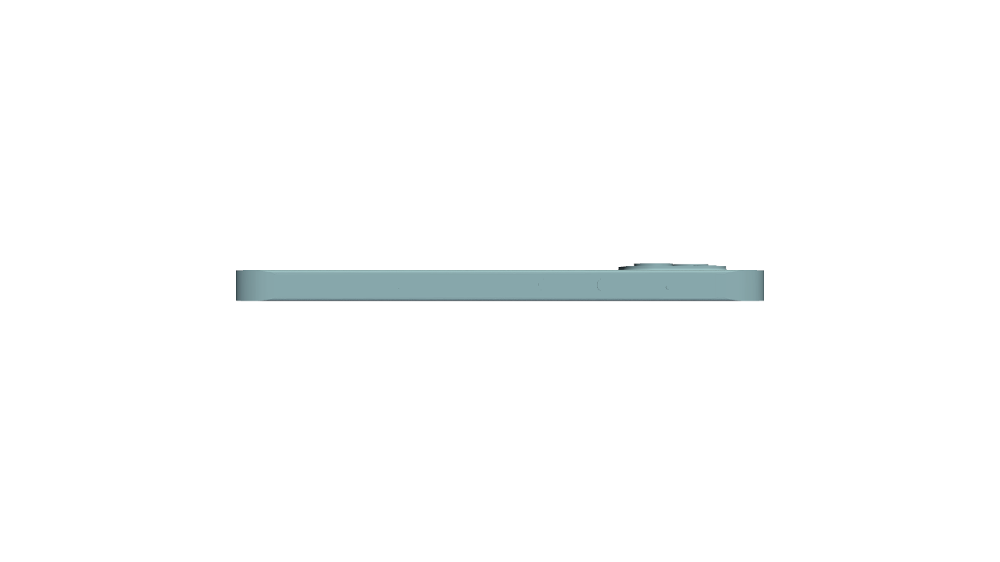
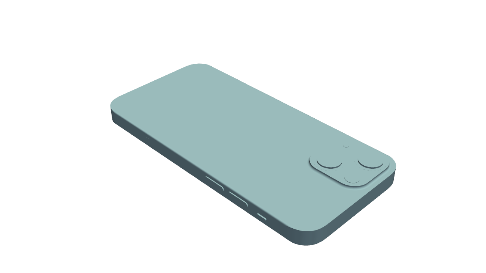
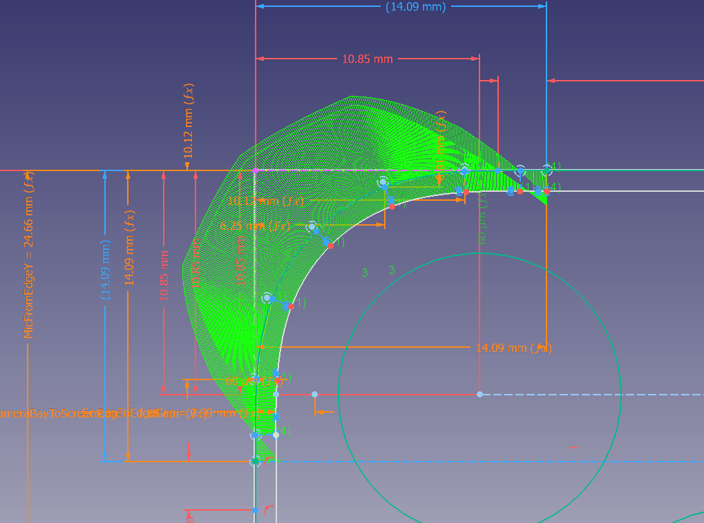
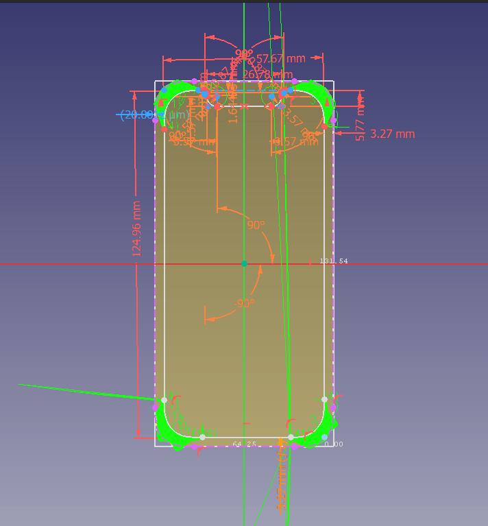

I did this iPhone 13 mini 3D model in [FreeCAD](https://www.freecad.org/) mostly as a learning exercise.

| Front | Top | Side | Isometric |
|---|---|---|---|
|  |  |  |  |

### Corner Profile

The corner profile is approximated using a "B-spline from knots" tool with points taken from [Apple's Accessory Design Guidelines](https://developer.apple.com/accessories/Accessory-Design-Guidelines.pdf). From the curvature comb, I guess it can pass for the "[G3 curve](https://en.rattibha.com/thread/1688398232974684160)", but I'm not sure:

Maybe I should try the [BlendCurve tool](https://wiki.freecad.org/Surface_BlendCurve) next time to see if I get a smoother curvature comb.

While the above corner profiles are consistent for the outer edge (since they are mirrored around the axes and perfectly connected), the same cannot be said for the inner "Active Screen Area" corners as it was done in haste:

## Unknown measurements

- The fillet radius of Camera Bay

## Outstanding tasks

- A sketch to define the glass edge on the screen front. (At the moment it's just the "Active Screen Area".)
- Check why the SIM tray outline is barely visible in STL output.
- Move measurements into variables and reference it in sketches.